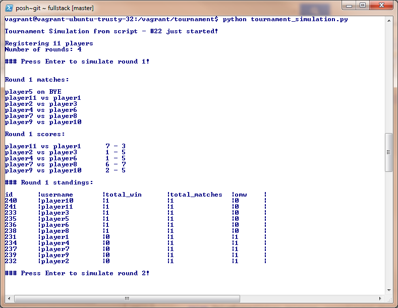

Swiss Tournament Pairing
===
##### PSql and Python code for data handling in Swiss-system tournaments

How to run a Swiss Tournament Simulation

- Install Python 2.7
- Install Python module psycopg2 [pip install psycopg2]
- install postgresSQL
- download the project folder on your computer
- Open cmd/terminal, navigate to the project folder
- create database:  
  `create database tournament`
- create database tables and views:  
  `psql tournament`  
  `\i tournament.sql`
- go back to the project folder and run  
  `python tournament_simulation.py`

>### ADDITIONAL NOTES
- More than one tournament is supported.
- DRAW matches are considered lost for both opponents
- PAIRINGS
 - Opponents are sorted and paired by total wins and OMW (Opponent Match Wins, the total number of wins by players they have played against)
 - Opponents might play against each other more than once in a tournament
- BYE
 - If the number of players in a tournament is an odd number, each round one of the players is on BYE (randomly picked)
 - A BYE is considered as a won match. 
 - A player can be on a BYE once per tournament.

